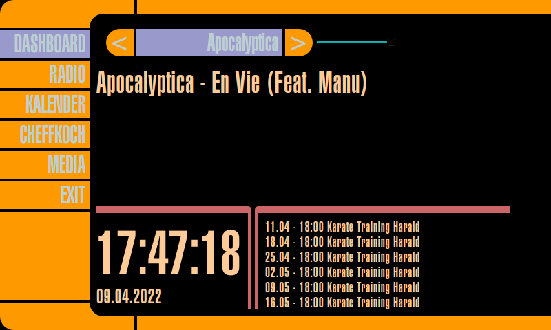

# Kueche
Kueche is a media player for Raspery-Pis with touchscreen. It is based on the Lcars interface known from StarTreck(tm).



The following is thus possible:
  * Listen to various internet radio stations.
  * Select and play music files on a data medium

The name Kueche comes from the German word 'Küche' as this radio is operated by being in my kitchen.

## Getting Started

At the current status, the project is probably still very difficult to put into operation yourself, as it is still in a very unfinished state.
You should have some experience in Python.
These instructions will get you a copy of the project up and running on your local machine for development and testing purposes..

### Prerequisites

You need to install some software to create your own LCARS display.
  * Python 3.x
  * PyQT5
  * xxhash
  * pyaudio
  * python3-alsaaudio
  * python3-qtpy
  * libqt4-dev
  * pylcars
  * PyAudio
  * python-mpv
  * mpv

### Installing 

#### Debian based 
```
sudo apt-get update 
sudo apt-get -y upgrade
sudo apt-get install python3 python3-pip portaudio19-dev python3-dev python3-alsaaudio libmpv-dev \
                     libpq-dev git build-essential libsasl2-dev libldap2-dev libssl-dev gcc \
                     libxml2-dev libxmlsec1-dev pkg-config portaudio19-dev python3-qtpy
pip3 install --upgrade pip setuptools wheel
git clone https://github.com/StowasserH/kueche.git
git clone https://github.com/StowasserH/pylcars.git
cd pylcars
pip3 install -r requirements.txt
pip3 install -e .
cd ..
cd kueche
pip install -r requirements.txt
python3 kueche.py
```


## Configuration

Please create a config.ini as follows. Then you can adjust the values in the file according to your needs:
```
cp config.ini_skeleton config.ini
```

### Sounds and fonts
For copyright reasons, the fonts and sounds folders are empty. However, there are many sound effects from the movies available on the internet that you can use.
You can also find beautiful fonts that match the movies.

### Calendar
If you want to use the Google calendar you have to get an oauth2 client_id for your account there.
Then your appointments can be displayed with the calendar_id.

## Development

Feel free to use and modify it, but please help me to improve it.

### Coding style

If you commit code pls try to format it in [PEP8](https://www.python.org/dev/peps/pep-0008/)


## Authors

* **Harald Stowasser** - *Initial work* - [StowasserH](https://github.com/StowasserH)

See also the list of [contributors](https://github.com/StowasserH/pylcars/contributors) who participated in this project.

## License

This project is licensed under the MIT License - see the [LICENSE](LICENSE) file for details
