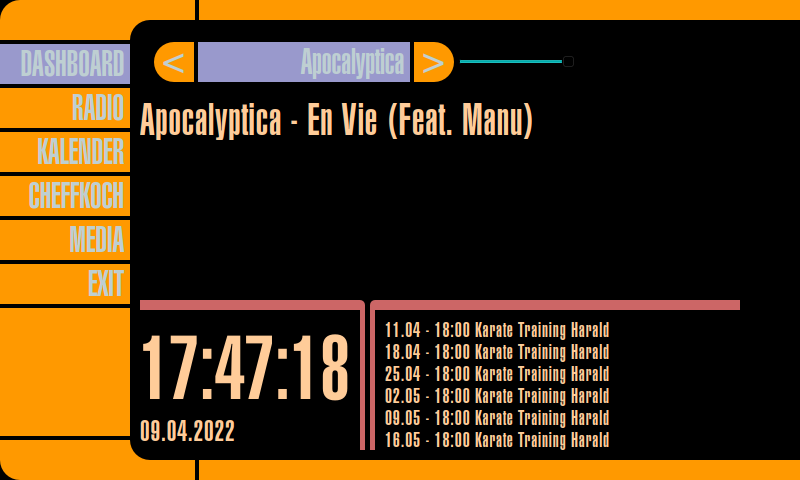

# Kueche
Kueche is a media player for Raspberry-Pis with touchscreen. It is based on the LCARS interface known from Star Trek (TM).



## Features

* **Internet Radio** - Listen to various internet radio stations
* **Local Music Player** - Select and play music files with an intuitive file browser
* **Playlist Manager** - Build, save, and load multiple playlists with shuffle mode
* **Google Calendar Integration** - Display upcoming calendar events with date grouping
* **LCARS UI** - Retro-futuristic interface inspired by Star Trek: The Next Generation
* **Touch-Friendly** - Optimized for Raspberry Pi with touchscreen (with virtual keyboard for input)
* **Plugin Architecture** - Modular plugin system with dependency injection for easy extension
* **Debug Logging** - Configurable file and console logging for troubleshooting

The name Kueche comes from the German word 'Küche' (kitchen) as this radio is operated in my kitchen.

## Getting Started

This project uses modern Python packaging with `pyproject.toml`. You'll need Python 3.8 or higher.

### Prerequisites

On Debian/Ubuntu-based systems:
```bash
sudo apt-get update
sudo apt-get -y upgrade
sudo apt-get install python3 python3-pip python3-dev portaudio19-dev libmpv-dev \
                     python3-alsaaudio git build-essential libsasl2-dev libldap2-dev \
                     libssl-dev libxml2-dev libxmlsec1-dev pkg-config qtbase5-dev
```

### Installation

1. **Clone repositories**:
```bash
git clone https://github.com/StowasserH/kueche.git
git clone https://github.com/StowasserH/pylcars.git

cd kueche
```

2. **Install dependencies**:
```bash
# Create virtual environment (recommended)
python3 -m venv .venv
source .venv/bin/activate

# Upgrade pip, setuptools, wheel
pip install --upgrade pip setuptools wheel

# Install pylcars first
pip install ../pylcars

# Install kueche and dependencies
pip install -e .
```

3. **Run the application**:
```bash
# Option 1: Using the run wrapper
python3 run_kueche.py

# Option 2: Using installed command
kueche

# Option 3: As a Python module
python3 -m kueche
```


## Configuration

Create a config.ini from the skeleton template:
```bash
cp config.ini_skeleton config.ini
```

Then edit `config.ini` to match your setup.

### Plugins

Kueche uses a modular plugin architecture. The following plugins are available:

* **Dashboard** - Main view with clock, radio controls, and volume slider
* **Radio** - Internet radio station player
* **Media** - File browser for local music with playlist integration
* **Playlist** - Build and manage multiple playlists (saves to `playlists/` directory)
* **Kalender** - Google Calendar integration with event display

Enable/disable plugins in the `[plugins]` section of `config.ini`.

### Media & Playlists

* **Media Browser**: Select folders and files to add to playlists
* **Playlist Management**: Save/load multiple playlists, toggle shuffle mode
* **Playlist Storage**: Each playlist is saved as a separate JSON file in the `playlists/` directory
* **Playback**: Play entire playlists via the radio player with auto-advance

### Sounds and Fonts

For copyright reasons, the fonts and sounds folders are empty. However, there are many sound effects from the Star Trek movies available online that you can use. You can also find beautiful fonts that match the LCARS design.

### Google Calendar Integration

To use the Google Calendar feature:

1. Get an OAuth2 `client_id.json` from [Google Cloud Console](https://console.cloud.google.com/)
2. Save it to the path specified in `[plugin.kalender]` section of `config.ini`
3. Set your Google Calendar ID in the config
4. The calendar will display upcoming events grouped by date with weekday names

### Debug Logging

Enable debug logging in the `[debug]` section of `config.ini`:
```ini
[debug]
enabled = true
level = DEBUG
file = ~/.kueche_debug.log
console = true
```

This will log application events to both console and file for troubleshooting.

## Development

Feel free to use and modify it, but please help me to improve it.

### Coding style

If you commit code pls try to format it in [PEP8](https://www.python.org/dev/peps/pep-0008/)


## Authors

* **Harald Stowasser** - *Initial work* - [StowasserH](https://github.com/StowasserH)

See also the list of [contributors](https://github.com/StowasserH/pylcars/contributors) who participated in this project.

## License

This project is licensed under the MIT License - see the [LICENSE](LICENSE) file for details
